## Summary for [IJRR 2013 paper](http://www.cvlibs.net/publications/Geiger2013IJRR.pdf)

Andreas Geiger, Philip Lenz, Christoph Stiller and Raquel Urtasun, "**Vision meets Robotics: The KITTI Dataset**", IJRR 2013

http://www.cvlibs.net/publications/Geiger2013IJRR.pdf

### Abstract:
```We present a novel dataset captured from a VW station wagon for use in mobile robotics and autonomous driving research. In total, we recorded 6 hours of traffic scenarios at 10-100 Hz using a variety of sensor modalities such as highresolution color and grayscale stereo cameras, a Velodyne 3D laser scanner and a high-precision GPS/IMU inertial navigation system. The scenarios are diverse, capturing real-world traffic situations and range from freeways over rural areas to innercity scenes with many static and dynamic objects. Our data is calibrated, synchronized and timestamped, and we provide the rectified and raw image sequences. Our dataset also contains object labels in the form of 3D tracklets and we provide online benchmarks for stereo, optical flow, object detection and other tasks. This paper describes our recording platform, the data format and the utilities that we provide.```

---
## Links and Reference
- KITTI dataset: http://www.cvlibs.net/datasets/kitti/
- Original paper on KITTI vision benchmark suite: http://www.cvlibs.net/publications/Geiger2012CVPR.pdf

## Key Summary

### 1. Sensor Setup
- 2x grayscale cameras - 1.4 Megapixels
- 2x color cameras - 1.4 Megapizels
- 1x Velodyne scanner - 10Hz, 64 beams, 0.09 degree angular resolution, 2cm distance accuracy, 26.8deg vertical field of view, range: 120m.
- 1x GPS/IMU unit

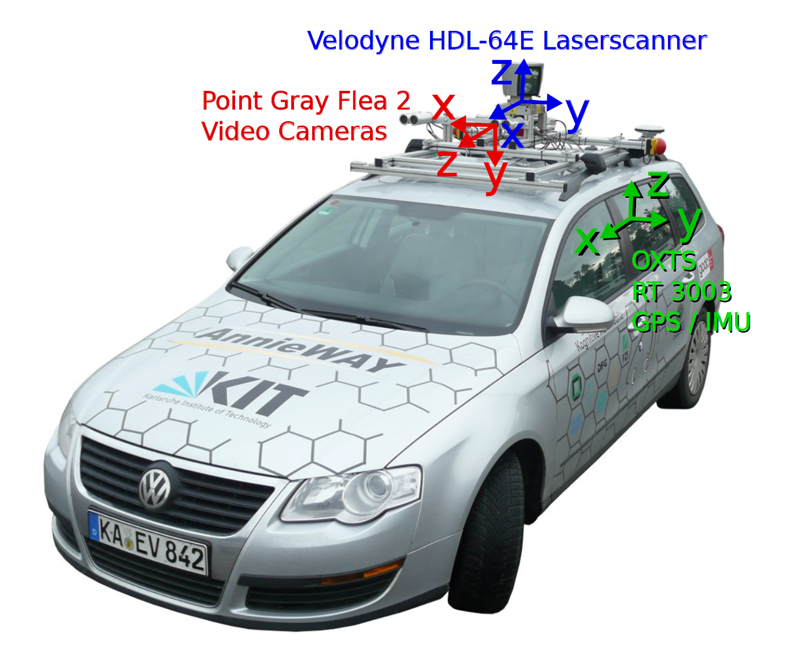

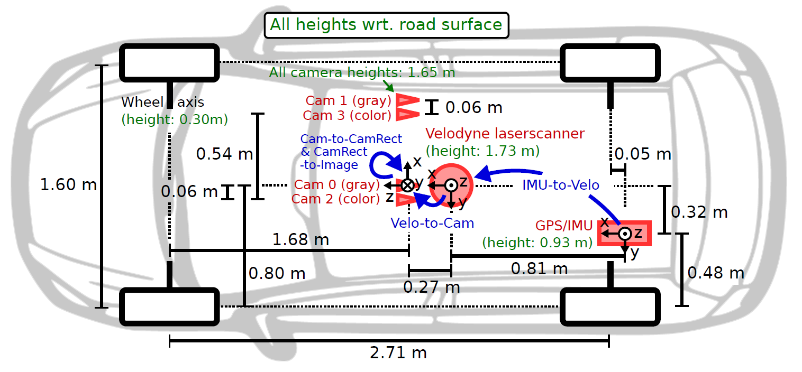

### 2. 3D Bounding Box
Annotations are provided in the form of 3D bounding box tracklets, represented in Velodyne coordinates.

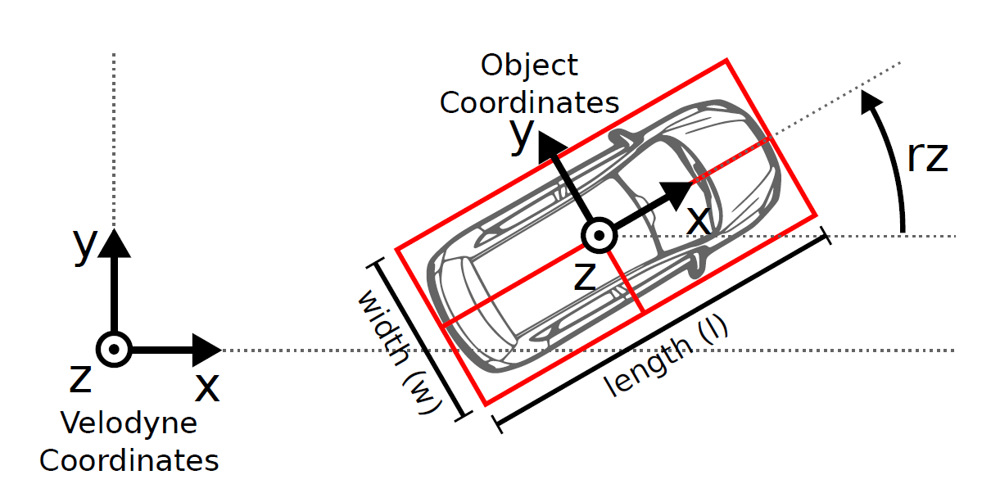

There should be 7 values:
- 3D box dimensions: width
- 3D box dimensions: length
- 3D box dimensions: height
- Velodyne position: x
- Velodyne position: y
- Velodyne position: z
- yaw angle: r (pitch and roll are assumed to be zero)

Example:

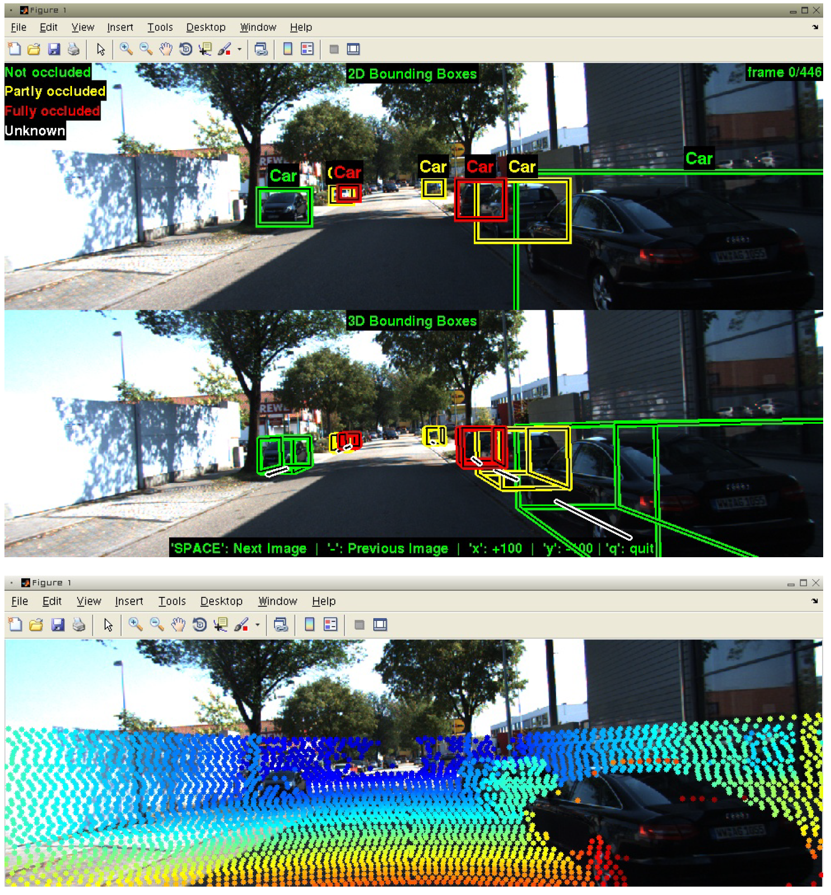

### 3. Development Kit

- `tracklets.h` - contains the main tracklet object, besises Matlab mex, it can also be directly interfaced with in C++.
- `run_demoTracklets.m` - demonstrates how 3D bounding box tracklets can be read from the XML files and projected onto the image plane of the cameras.
- `run_demoVelodyne.m` - demonstrates projection of 3D Velodyne point clouds into the image plane.
- `run_demoVehiclePath.m` - shows how to read and display the 3D vehicle trajectory using the GPS/IMU data. It calls `convertOxtsToPose()`, which takes converts GPS/IMU measurements to 6D pose of the vehicle in Euclidean space.
- function `loadCalibrationCamToCam()` - can be used to read the intrinsic and extrinsic calibration parameters of the four video sensors
- function `loadCalibrationRigid()` - can be used to parse other 3D rigid object transformations.

### 4. Conventions

Positive values in directions:
- Camera: x = right, y = down, z = forward
- Velodyne: x = forward, y = left, z = up
- GPS/IMU: x = forward, y = left, z = up

Camera index:
- 0 - left grayscale
- 1 - right grayscale
- 2 - left color
- 3 - right color

### 5. Synchronization

- Timestamps of the Velodyne 3D laser scanner used as a reference.
- Each spin of lidar is one frame.
- Each time scanner rotates to forward position, cameras are triggered to capture one image. Hence, cameras and lidar are synchronized.
- However, GPS/IMU's clock is not linked to Velodyne. Instead, closed GPS time-stamp is used. Since GPS time updates at 100Hz, i.e. 1 reading every 10ms, worst-case difference is 5 ms.

### 6. Calibration and Projections

Calibration parameters are in `calib_cam_to_cam.txt` using the following notation:

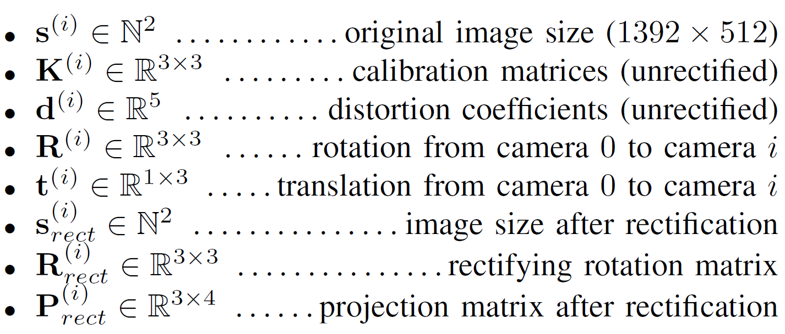

Notes:
- Rectified (i.e undistorted) images are cropped, hence sizes are smaller than original.
- Reference camera refers to camera 0 (left grayscale)

#### Camera-to-camera projection
The projection of a 3D point x = (x; y; z; 1)^T in rectified (rotated) camera coordinates to a point y = (u; v; 1)^T in the i-th camera image is given as

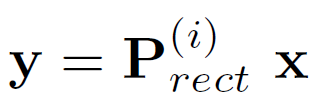

with i-th projection matrix:

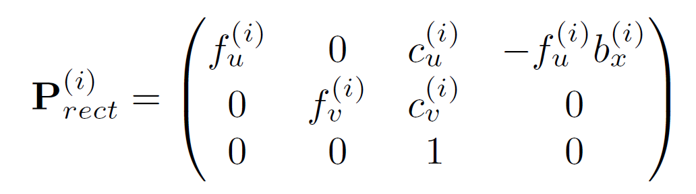

where b_x^(i) is the baseline (in meters) to reference camera.

In order to project a 3D point x in reference camera coordinates to a point y on the i’th image plane, the rectifying rotation matrix of the reference camera R_rect^0 must be considered as well:

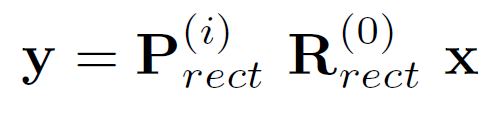

(Note: R_rect^0 is expanded to 4x4 by appending zeros in last column/row and setting last diagonal element to 1.)

#### Velodyne-to-camera projection

The rigid body transformation from Velodyne coordinates to camera coordinates is given in `calib_velo_to_cam.txt`:

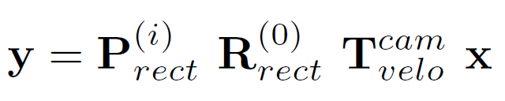

where

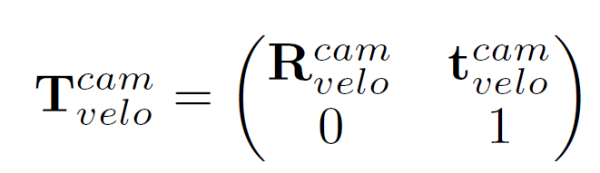

and

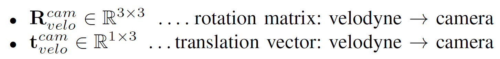

#### GPS/IMU-to-camera projection

The rotation matrix R_imu^velo and the translation vector t_imu^velo are stored in `calib_imu_to_velo.txt`. A 3D point x in IMU/GPS
coordinates gets projected to a point y in the i’th image as

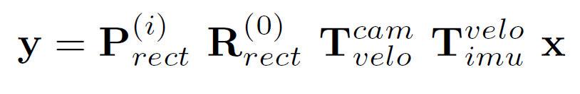


